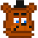
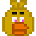
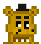

# FNAF_IA

Este é um projeto em desenvolvimento de uma inteligência artificial (IA) baseada no jogo Five Nights at Freddy's (FNAF) utilizando Python e Pygame.

## Sobre  Projeto
O objetivo deste projeto é replicar o comportamento da IA do jogo Five Nights at Freddy's 1 em um ambiente controlado. Isso inclui a criação de personagens animatrônicos que se movem de forma autônoma e tentam atacar o jogador, seguindo padrões de comportamento predefinidos.

## Mecânicas básicas do FNAF

### Funcionamento dos Animatrônicos
Os animatrônicos se movem com base em um sorteio de 1 a 20. Se o `valor atribuído ao animatrônico` for superior ao `número sorteado`, ele será capaz de se movimentar.
Os níveis dos animatrônicos são definidos pelo número da noite, e são incrementados ao passar das horas (no jogo).
Os valores inciais de cada animatrônico são:

|  |  Bonnie | Chica | Foxy | Freddy |
|----------------------------------------------------------------|------------------------------------------------------------------------|-------|------|--------|
| Noite 1                                                        | 0                                                                      | 0     | 0    | 0      |
| Noite 2                                                        | 3                                                                      | 1     | 1    | 0      |
| Noite 3                                                        | 0                                                                      | 5     |2| 1      |
| Noite 4                                                        | 2                                                                      | 4     |6| 1 ou 2 |
| Noite 5                                                        | 5                                                                      | 7     |5|3|
| Noite 6                                                        | 10                                                                     | 12    |16|4|

Até as 2 horas da manhã, os valores dos animatrônicos não são alterados. No entanto, a partir desse horário, os valores serão incrementados, com exceção de Freddy, cujo valor nunca é aumentado.
Os incrementos são dados por:

|      | Bonnie | Chica | Foxy | Freddy |
|-------|------|-----|----|------|
| 12 AM | +0   | +0  | +0 | +0   |
| 1 AM  | +0   | +0  | +0 | +0   |
| 2 AM  | +1   | +0  | +0 | +0   |
| 3 AM  | +1   | +1  | +1 | +0   |
| 4 AM  | +1   | +1  | +1 | +0     |
| 5 AM    | +0     | +0    | +0   | +0     |

### Caminho e Ataque 
> Em produção

### Duração das noites

No FNAF, cada hora dura 1 minuto e 26 segundos no mundo real. Desta forma, cada noite tem uma duração exata de 8 minutos e 36 segundos.
Em versões antigas para mobile, esses valores eram menores, mas aqui foi levado em consideração o tempo padrão.
Ao chegar às 6 da manhã, o jogo é imediatamente finalizado, sendo vitória para o jogador.

### Energia, Portas e Luzes 
> Em produção

> Este README está em processo de desenvolvimento e ainda não está finalizado. Novas seções e informações serão adicionadas em breve.

